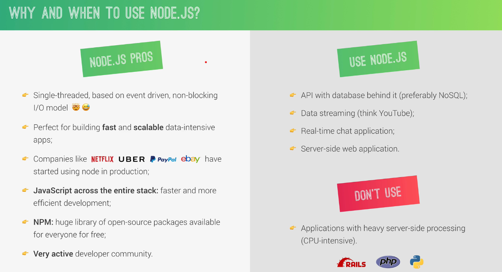
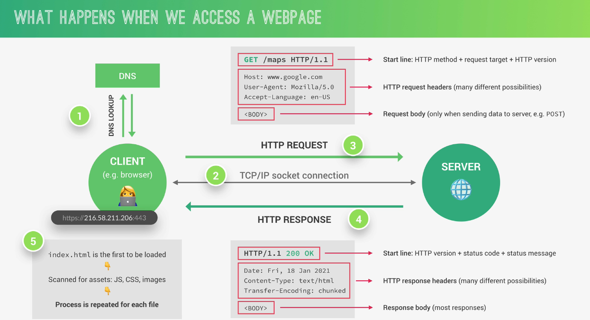

# Anotações sobre Node.js

## Introdução ao Node.js

Node.JS is a JavaScript runtime built on Google's open-source V8 JavaScript engine. É basicamente uma maneira que acharam para fazer com que o JavaScript executasse fora do navegador, sem limitações.

Um dos pontos positivos é o NPM, o fato de ser usado por diversas empresas, e com ele o JavaScript é a linguagem tanto do front, quanto do back-end.



---

Usamos o módulo File System para realizar escritas e leituras em arquivos. Mais conteúdo sobre esse assunto clicando [aqui](https://www.w3schools.com/nodejs/nodejs_filesystem.asp "File System Module").

```
const fs = require('fs');
```

---

Usamos o módulo HTTP para trabalharmos com Servers. Mais conteúdo sobre esse assunto clicando [aqui](https://www.w3schools.com/nodejs/nodejs_http.asp "HTTP Module").

```
const http = require('http');
```

---

Usamos o módulo URL para trabalharmos com Routing. Mais conteúdo sobre esse assunto clicando [aqui](https://www.w3schools.com/nodejs/nodejs_url.asp "URL Module").

```
const url = require('url');
```

## API's

No começo do curso, a definição que tinhamos de API era a seguinte:

Uma API é basicamente um serviço no qual iremos solicitar algum tipo de dado. No projeto NodeFarm fizemos a criação de uma API local, a qual nos devolve os dados dos produtos dessa nossa fazenda. Com essa aplicação conseguimos entender alguns conceitos básicos sobre API's.

Posso dizer que uma API é um pedaço do Software que pode ser usado por outro pedaço de Software, permitindoo assim que aplicações conversem entre si.

### REST - Representational States Transfer

Para uma API seguir o modelo REST de arquitetura ela precisa de seguir os seguintes princípios:

- Separate API into logical **resources**
- Expose structured, **resource-based URLs**
- Use **HTTP methods** (verbs)
  - Create
  - Read
  - Update
  - Delete
- Send data as **JSON** (usually)
- Be **stateless**

## Async Functions e Promises em JavaScript

### Promises

As Promises em JavaScript são usadas quando a gente precisa de realizar operações assíncronas. Elas representam um valor que pode ou não estar disponível, esse valor pode não estar disponível agora, mas pode estar após algumas linhas de código. Uma Promise pode estar em um dos três estados: `pending` (pendente), `fulfilled` (realizada) ou `rejected` (rejeitada).

**Exemplo de Promise:**

```javascript
let promise = new Promise((resolve, reject) => {
  let sucesso = true;

  if (sucesso) {
    resolve("Aceita");
  } else {
    reject("Rejeitada");
  }
});

// A parte do código acima vai ser executada de forma assíncrona. Quando precisarmos dessa Promise em um outro momento do código, a gente chama a função then, que nos trás o resultado (Parte que se encontra abaixo desse comentário).

promise
  .then((message) => {
    console.log(message);
  })
  .catch((error) => {
    console.error(error);
  });
```

### Async Functions

Async functions são uma forma mais simples e limpa de trabalhar com operações assíncronas usando a sintaxe async/await. Uma função declarada com async retorna uma Promise e a palavra-chave await pode ser usada para esperar por uma Promise.

**Exemplo de Async Function:**

```javascript
async function fetchData() {
  try {
    let response = await fetch("https://api.example.com/data");
    let data = await response.json();
    console.log(data);
  } catch (error) {
    console.error("Erro ao buscar os dados:", error);
  }
}

fetchData();
```

## NPM

O npm é um gerenciador de pacotes para o Node.JS npm, Inc. é uma subsidiária do GitHub, que fornece hospedagem para desenvolvimento de software e controle de versão com o uso do Git. npm é o gerenciador de pacotes padrão para o ambiente de tempo de execução JavaScript Node.js. è possível acessar o site por meio do link: [www.npmjs.com](https://www.npmjs.com).

No NPM temos dois tipos de módulos que podemos baixar, sendo eles:

- Dependências
- DevDependências

As dependências são aqueles módulos que o seu programa precisa ter instalado para que funciona, ele depende das funções que estão naquele módulo.
\
Já as DevDependências são aquelas que te ajudaram a desenvolver aquele projeto, não necessariamente seu projeto depense dela, é mais uma dependência na questão de desenvolver aquilo.
\
\
Podemos dizer que existem as locais e globais, sendo as locais as que funcionam somente no projeto que foram instaladas e as globais funcionando em todos (é mais comum que as dependências de desenvolvimento sejam instaladas de maneira global).

Para poder instalar os módulos é necessário usar um `npm init` para inciarlizar seu projeto.

Ambas podem ser instaladas pelo comando:\
 `npm install 'nome do module'`\
 ou: `npm install 'nome do module --global'`

## WebDevelopment

Abaixo salvei uma ilustração que mostra como ocorre o acesso do cliente em Web Pages, como funciona a comunicação entre Cliente-Servidor.



---

Tópicos importantes sobre como o Node.Js realmente funciona:

- Single Thread
- Thread Pool
- Event Loop

## Postman

Postman é uma empresa global de software que oferece uma plataforma de API para desenvolvedores projetarem, construírem, testarem e colaborarem em APIs. Mais de 30 milhões de usuários registrados e 500.000 organizações usam o Postman.

Estamos utilizando essa ferramenta no projeto chamado Natours para poder ver e praticar como funciona essa comunicação com a API, os comandos, as ideias, os princípios, dentre outros conceitos.

Nesse tópico aprendemos os conceitos básicos acerca do CRUD, que é um conjunto de opreções que pertencem ao agrupamento chamado de Data Manipulation Language (Linguagem de Manipulação de Dados) e que é essencial para o funcionamento do Postman, abaixo temos o significado e as funcionalidades de cada uma das operações:

- **Create:** Criação, registro ou cadastro de informações e dados em um determinado lugar.
- **Read:** Consultar os dados em um website.
- **Update:** Caso você seja o dono dos dados ou tem permissão para editá-los, atualiza as informações que julgar necessárias.
  - **PUT:** Alteração completa de um dado.
  - **PATCH:** Alteração parcial de um dado.
- **Delete:** Remoção de dados a partir do operador do sistema.

## MongoDB

MongoDB é um banco de dados NoSQL orientado a documentos que armazena dados em um formato flexível e de fácil uso, chamado BSON (uma representação binária de JSON, formato esse que já estamos acostumados a utilizar com o Node.JS). Ele foi projetado para lidar com grandes volumes de dados e fornecer alta performance, escalabilidade e disponibilidade.

Um dos destaques do MongoDBs são as seguintes características:

- **Orientado a Objetos:** Ao invés de usar tabelas e linhas ele usa coleções e documentos.
- **Flexibilidade:** Diferentes documentos da mesma coleção podem ter campos e estruturas diversas (Mas é necessário muita atenção para se atrapalhar com essas diversas estruturas diferentes).
- **Alta Disponibilidade**: Possui réplicas para garantir alta disponibilidade e capacidade de recuperação.
- **Desempenho:** É otimizado para operações de leitura e escrita de alto desempenho, com suporte para índices, cache na memória, e execução paralela.

### MVC

O MVC (Model-View-Controller) é um padrão de arquitetura de software que separa a aplicação em três componentes principais: Modelo (Model), Visão (View) e Controlador (Controller). As funções e resumo de cada um desses componentes segue abaixo:

- **Model:** Representa os dados da aplicação e a lógica de negócios e gerencia o acesso e a manipulação dos dados.
- **View:** Apresenta os dados ao usuário, renderiza a interface gráfica, recebe entradas do usuário e as encaminha para o Controlador.
- **Controller:** Interpreta as entradas do usuário e as converte em ações a serem executadas, atua como se fosse o intermediário entre o Modelo e a Visão.

### Atlas MongoDB e MongoDB Compass

Essas duas ferramentas são as que estão sendo usadas para podermos aplicar e testar todas as operações relacionadas ao Banco de Dados.

**Atlas MongoDB** é a plataforma de banco de dados como serviço da MongoDB, que oferece uma solução gerenciada e totalmente automatizada para hospedar, operar e escalar clusters de banco de dados MongoDB na nuvem.

**MongoDB Compass** é uma interface gráfica de usuário para MongoDB, que permite que os usuários explorem e manipulem seus dados visualmente.
