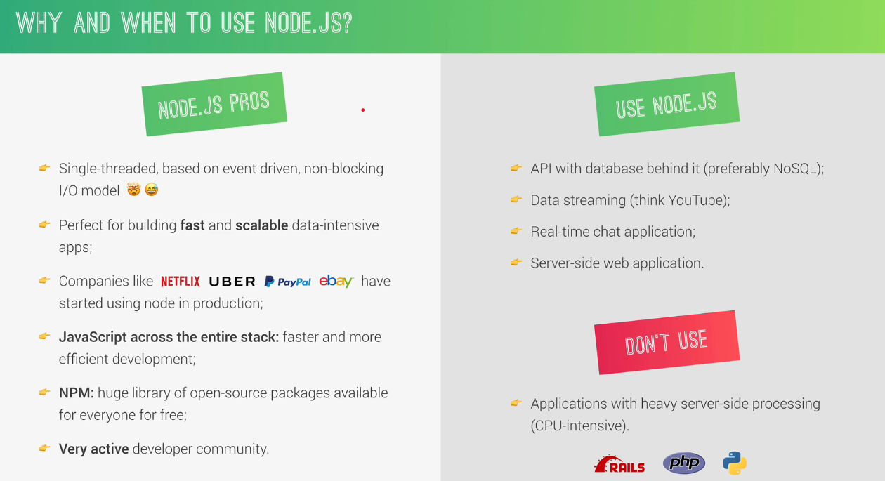

# Anotações sobre Node.js

## Introdução ao Node.js
Node.JS is a JavaScript runtime built on Google's open-source V8 JavaScript engine. É basicamente uma maneira que acharam para fazer com que o JavaScript executasse fora do navegador, sem limitações.

Um dos pontos positivos é o NPM, o fato de ser usado por diversas empresas, e com ele o JavaScript é a linguagem tanto do front, quanto do back-end.



---
Usamos o módulo File System para realizar escritas e leituras em arquivos. Mais conteúdo sobre esse assunto clicando [aqui](https://www.w3schools.com/nodejs/nodejs_filesystem.asp 'File System Module').
```
const fs = require('fs');
```
---
Usamos o módulo HTTP para trabalharmos com Servers. Mais conteúdo sobre esse assunto clicando [aqui](https://www.w3schools.com/nodejs/nodejs_http.asp 'HTTP Module').
```
const http = require('http');
```
---
Usamos o módulo URL para trabalharmos com Routing. Mais conteúdo sobre esse assunto clicando [aqui](https://www.w3schools.com/nodejs/nodejs_url.asp 'URL Module').
```
const url = require('url');
```

## API's

Uma API é basicamente um serviço no qual iremos solicitar algumtipo de dado. No projeto NodeFarm fizemos a criação de uma API local, a qual nos devolve os dados dos produtos dessa nossa fazenda. Com essa aplicação conseguimos entender alguns conceitos básicos sobre API's.

## NPM

O npm é um gerenciador de pacotes para o Node.JS npm, Inc. é uma subsidiária do GitHub, que fornece hospedagem para desenvolvimento de software e controle de versão com o uso do Git. npm é o gerenciador de pacotes padrão para o ambiente de tempo de execução JavaScript Node.js. è possível acessar o site por meio do link:  [www.npmjs.com](https://www.npmjs.com).

No NPM temos dois tipos de módulos que podemos baixar, sendo eles:

- Dependências
- DevDependências

As dependências são aqueles módulos que o seu programa precisa ter instalado para que funciona, ele depende das funções que estão naquele módulo.
\
Já as DevDependências são aquelas que te ajudaram a desenvolver aquele projeto, não necessariamente seu projeto depense dela, é mais uma dependência na questão de desenvolver aquilo.
\
\
Podemos dizer que existem as locais e globais, sendo as locais as que funcionam somente no projeto que foram instaladas e as globais funcionando em todos (é mais comum que as dependências de desenvolvimento sejam instaladas de maneira global).

Ambas podem ser instaladas pelo comando:\
    `npm install 'nome do module'`\
 ou: `npm install 'nome do module --global'`

Para isso antes é necessário usar um `npm init` para inciarlizar seu projeto e poder realziar as instalações das dependências.